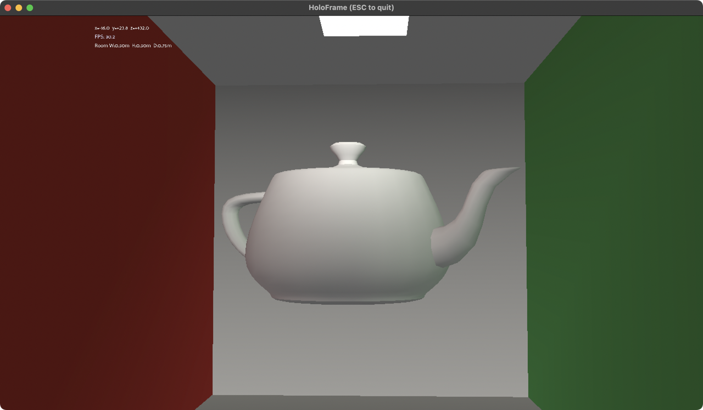

[](https://twitter.com/deanthecoder)

# HoloFrame
An experimental [Panda3D](https://www.panda3d.org/) showcase that turns your monitor into a faux holographic window. HoloFrame combines real-time head tracking, a [Cornell box](https://en.wikipedia.org/wiki/Cornell_box) inspired scene, and configurable room dimensions to keep a 3D model anchored in space as you move.

## Features
- Head pose tracking (MediaPipe + OpenCV) drives the virtual camera position.
- Full-screen windowed Panda3D viewport with adjustable room dimensions.
- Cornell-style lighting with a ceiling panel placeholder for the key light.
- Minimal HUD with FPS, camera pose readout, and in-app control hints (toggleable).

## Controls
- `ESC` — Quit the application.
- `f` — Toggle fullscreen mode.
- `h` — Toggle HUD visibility.
- `?` (or `Shift-/`) — Toggle on-screen control help.
- Arrow keys — Adjust room width/height.
- `l` / `p` — Pull/push the back wall to tweak room depth.

## Screenshot


## Getting Started
1. Install dependencies:
   ```bash
   python3 -m pip install --upgrade pip
   pip install opencv-python mediapipe numpy panda3d
   ```
2. Launch the app:
   ```bash
   python3 HoloFrame.py
   ```

Make sure your webcam is accessible; the app will exit if a camera stream cannot be opened.
